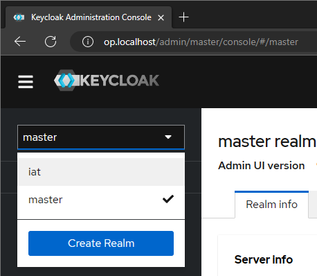
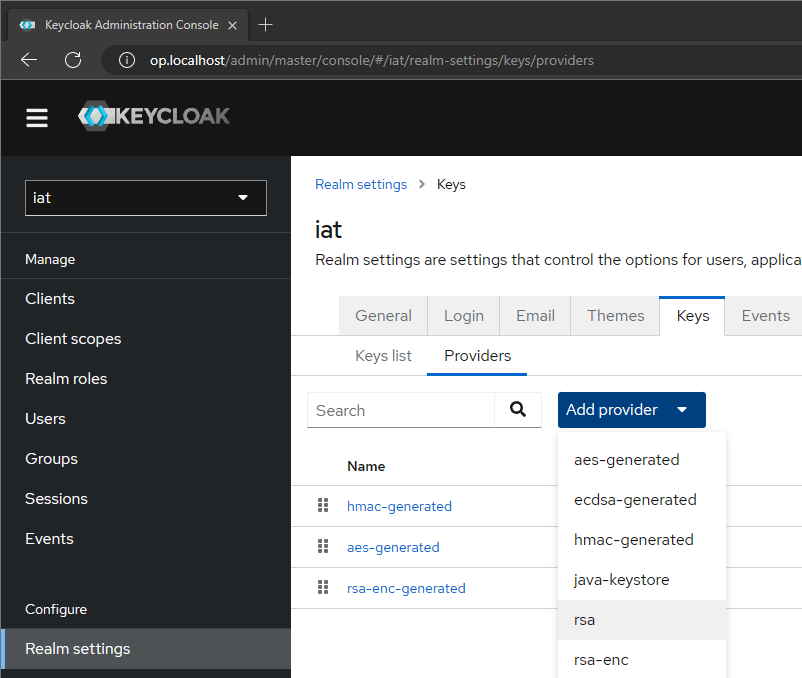
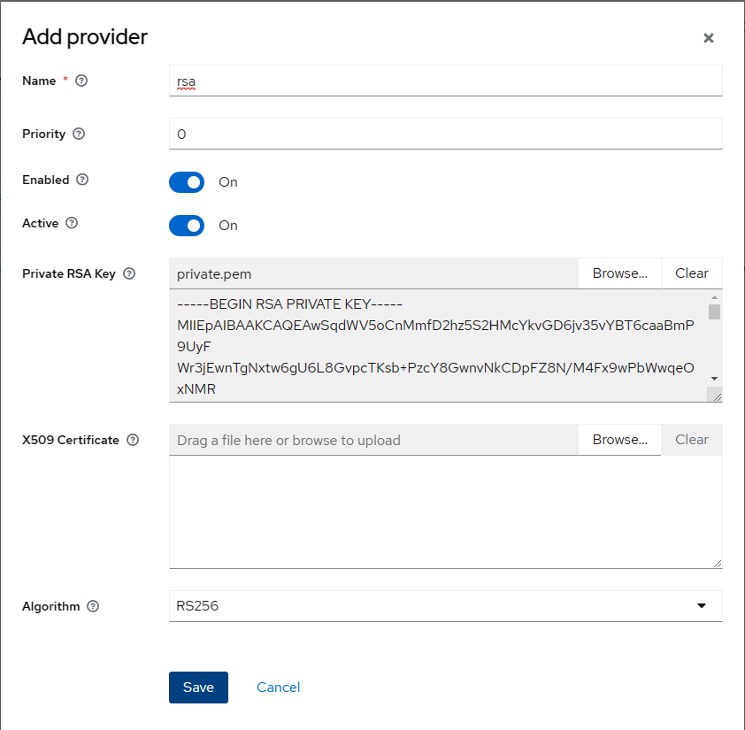
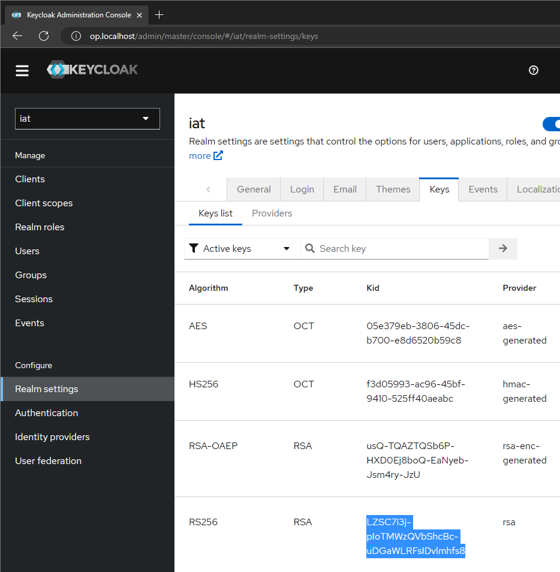
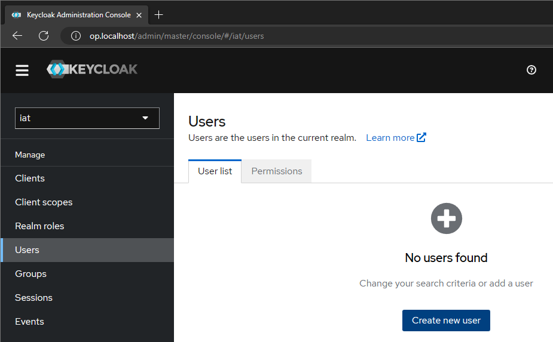
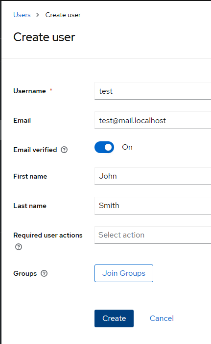
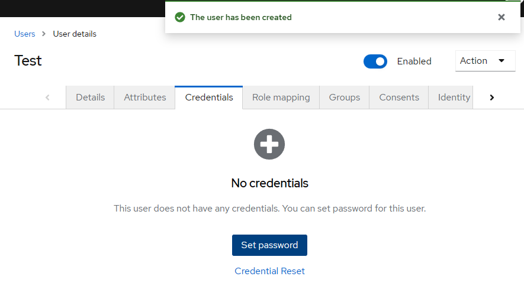
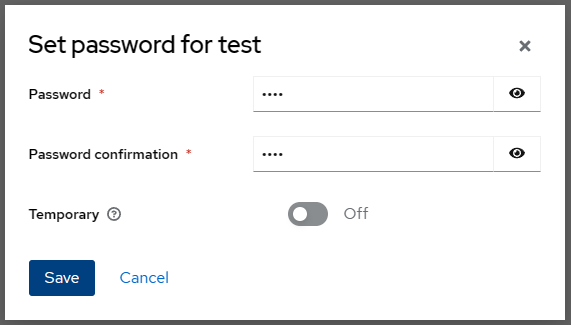

# Environment Setup

This section describes how to setup a test environment locally with Docker Compose.

**WARNING: THIS IS FOR TEST PURPOSES ONLY! DO NOT USE THIS IN PRODUCTION!!!**

## 1. Clone Repository

In your Linux bash, clone this repository to your home directory:

```bash
git clone https://github.com/JonasPrimbs/oidc-e2ea-server.git
```

Now navigate to the cloned directory:

```bash
cd oidc-e2ea-server
```

## 2. Generate Secrets

Execute the following command:

```bash
bash ./generate-secrets.sh
```

This will randomly generate all usernames, passwords, and private keys which are unique for your installation and store them in the new directory `.secrets/` and a `.env` file in the repository.

## 3. Configure Deployment

Go to the generated `/.env` file and configure the following parameters:

-   `OP_HOST=<your-hostname>` the host/domain name of your server. Default is `op.localhost`.

For a local deployment, you can leave these settings at default.

## 4. Initial Infrastructure Start

Start up your OpenID Provider for the first time using the following command:

```bash
docker compose up -d op
```

This might take a while to download all related container images.

## 5. Setup OpenID Provider

This section describes how to setup the Keycloak OpenID Provider to make it ready to issue ID Certifcation Tokens.

### 5.1. Login to Keycloak Admin Console

Open your browser and go to `http://<your-hostname>/admin/` where `<your-hostname>` is your configured hostname.
By default, this is [http://op.localhost/admin](http://op.localhost/admin).
Then _sign in_ with the credentials generated in the following files:

-   Username: `/.secrets/op_username.txt`
-   Password: `/.secrets/op_password.txt`

_If you experience a_ **Bad Gateway** _error, wait for up to one minute until you Keycloak instance is ready!_

### 5.2. Switch to Realm

On the top left, click the dropdown menu and select the realm `ict`:



### 5.3. Import Private Key

Import the generated private key as follows:

1.  Go to _Configure_ > _Realm settings_ > _Keys_ > _Providers_.
2.  In _Add provider_, select the option _rsa_.

    

3.  In field _Private RSA Key_, select _Browse..._ and select the generate `private.pem` private key file in the `/.secrets/` directory of the cloned repository.
4.  Click _Save_ to store the changes.

    

### 5.4. Configure Private Key

1.  Go to the file `/.secrets/ict.env`.
2.  Copy the _Kid_ of your newly generated key of _Type_ `rsa` from _Configure_ > _Realm settings_ > _Keys_ > _Key list_.

    

3.  Paste the copied _Kid_ parameter to the `/.secrets/ict.env` file as value for the key `KID`, e.g.:

```bash
KID=GFSKUd9yi3LiQhT6HKuU4IOymufp_OIIlG8DmGa8hvs
```

### 5.5. Create Test User

Create a new test user as follows:

1.  Go to _Manage_ > _Users_ > _User list_ > _Create new user_.

    

2.  Insert at least a _Username_.
3.  _Create_ the user.

    

4.  In the tab _Credentials_, click _Set password_.

    

5.  Insert a _Password_, repeat it in _Password confirmation_, and set _Temporary_ to `off`.
    Then click _Save_.

    

6.  Confirm the dialog by clicking _Save password_.

## 6. Configure Deployment Mode

This step depends on your intention why you run this deployment.

-   **Testing**: Choose this mode if you want to just run the deployment for testing purposes.
-   **Development**: Choose this mode if you want to change the implementation of the ICT endpoint application.

### 6.1. Test Deployment

_Do this step only if you want to run this deployment for **testing** purposes!_

1. Go to `/docker-compose.yaml`.
2. Uncomment line 65 (`image` attribute in service `ict`).
3. Comment line 68 to 70 (`build` attribute in service `ict`).

### 6.2. Development Deployment

_Do this step only if you want to run this deployment for **development** purposes!_

1. Go to `/docker-compose.yaml`.
2. Comment line 65 (`image` attribute in service `ict`).
3. Uncomment line 68 to 70 (`build` attribute in service `ict`).

## 7. Restart Infrastructure

Stop the infrastructure with the following command:

```bash
docker compose down
```

And start it again:

```bash
docker compose up -d
```
